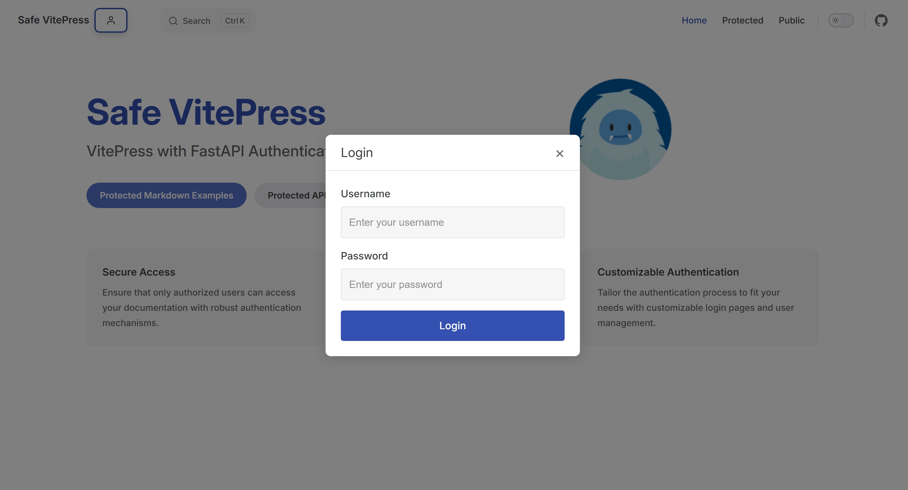

# Safe VitePress

一个将 VitePress 前端与 FastAPI 后端认证相结合的安全文档解决方案。



## 特性
- **FastAPI认证**：基于JWT 的认证系统，支持基于角色的访问控制
- **Vitepress集成**：受保护的文档路由，带有无缝的认证流程
- **安全访问控制**：文档页面的细粒度权限管理
- **现代UI**：简洁、响应式设计，内置深色模式支持

## 技术架构
- **前端**：Vitepress 与 Vue 3 组件
- **后端**：FastAPI，使用 Pydantic 模型和 Tortoise-ORM
- **认证**：基于JWT令牌的认证，使用安全的 HTTP-only cookies
- **数据库**：SQLite，支持迁移


## 安装指南

### 前提
- Python 3.10+
- Node.js 18+
- pnpm

### 后端
```bash
pipenv --python 3
pipenv shell
pip install -r requirements.txt
python run.py
```

### 前端
```bash
pnpm i
pnpm dev
```
