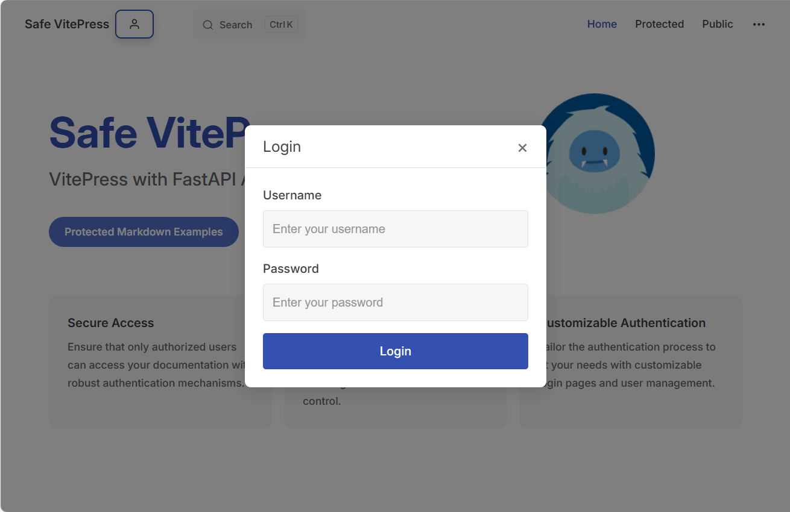
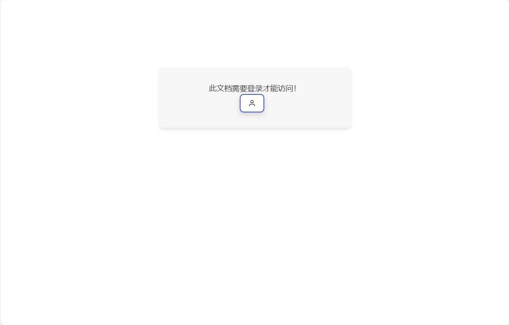
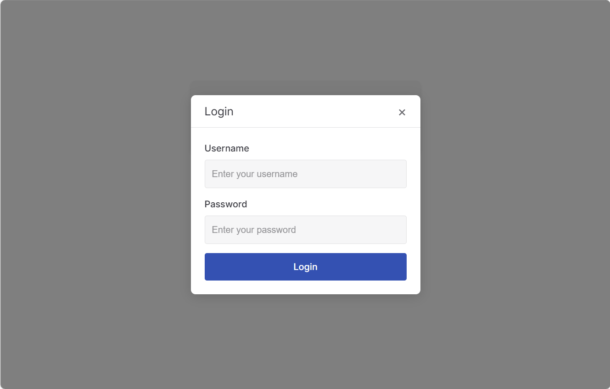
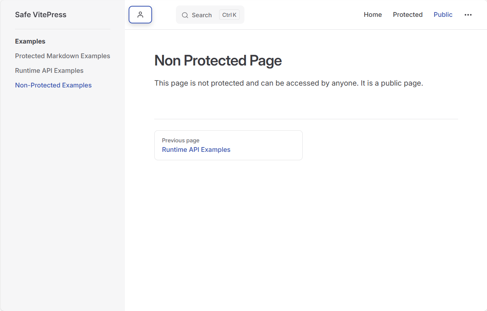

# Safe VitePress

一个将 VitePress 前端与 FastAPI 后端认证相结合的安全文档解决方案。

**点击左上角登录按钮**



**点击受保护的文档**



点击登录



**无需登录,可访问公开的文档**



## 特性
- **FastAPI认证**：基于JWT 的认证系统，支持基于角色的访问控制
- **Vitepress集成**：受保护的文档路由，带有无缝的认证流程
- **安全访问控制**：文档页面的细粒度权限管理

## 技术架构
- **前端**：Vitepress 与 Vue 3 组件
- **后端**：FastAPI，使用 Pydantic 模型和 Tortoise-ORM
- **认证**：基于JWT令牌的认证，使用安全的 HTTP-only cookies
- **数据库**：SQLite，支持迁移


## 安装指南

### 前提
- Python 3.10+
- Node.js 18+
- pnpm

### 后端
```bash
pipenv --python 3
pipenv shell
pip install -r requirements.txt
python run.py
```

创建管理员用户:
```bash
python create_admin_db.py
# 根据提示输入用户名和密码
```

### 前端
```bash
pnpm i
pnpm dev
```
打包发布:

```bash
pnpm build
```
